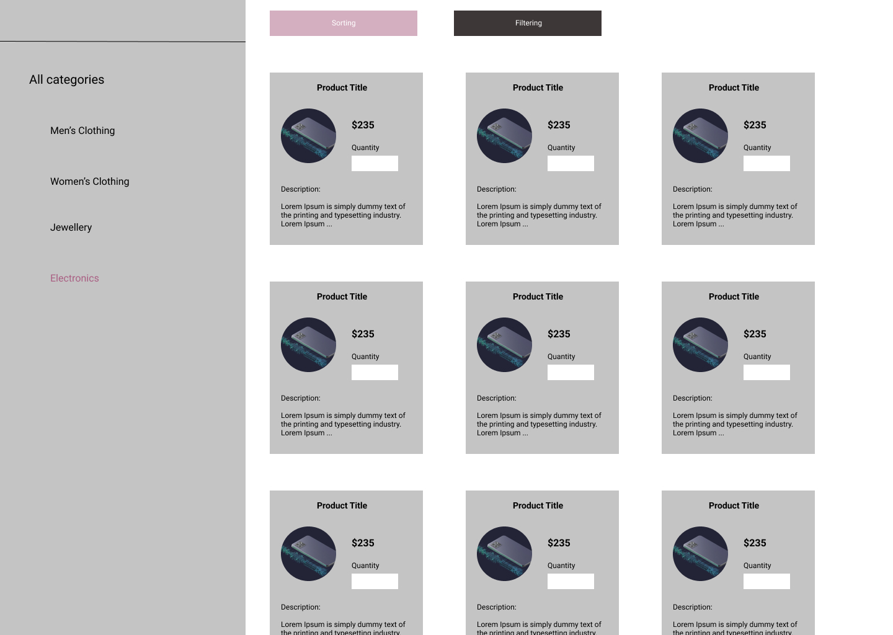

### Assignment use cases

1. Implement UI based on below UX design (take this as reference, need not to be exact similar).
2. Show list of categories and products.
3. On click of category, show corresponding products.
4. On click of all categories, show all products for all categories.
5. Price range based filtering (could make use of slider)

### Framework:

- Free to use any framework for html, CSS, JS or TS.

### Brownie Points:

1. sorting based on prices
2. sorting based on discounts (assume discount of 10 % discount on jewellery and 30% discount on men's clothing), applicable only when "All categories" is selected.

### Expectation/Evaluation Criteria:

1. **Code Modularity (Highest priority)** - Assignment should have different components/services/files for different functionalities following Single Responsibility Principle and Separation of Concerns

2. **Bug Free Code (Highest priority)** - It’s ok if any of the acceptance criteria is not delivered but the ones delivered should be bug free. For eg. If price based filtering is not provided due to time constraint, it is acceptable but broken functionality should not be submitted in the final PR

3. **Naming Conventions (High Priority)** - All the variables and functions should be named in a way that it represents what is purpose of having that variable/function in the code. Also the naming should be consistent across the code whether it be camel case or snake case or something else. Also some common practices should be followed e.g. classes always start with capital letters

4. **Readable Code (Medium Priority)** - Code should be properly indented and prettified.

5. **UI (Low Priority)** - How neat and pretty the UI looks. If candidate has time, they can use any UI library like bootstrap/material to make the UI more beautiful to earn more points.

### API Reference:

Make use of API's from https://fakestoreapi.com/docs

### Assignment submission:
* Fork this repository, commit and push changes to your forked repository.
* Raise a PR in this repo with your forked repository changes.

### UX Design:

